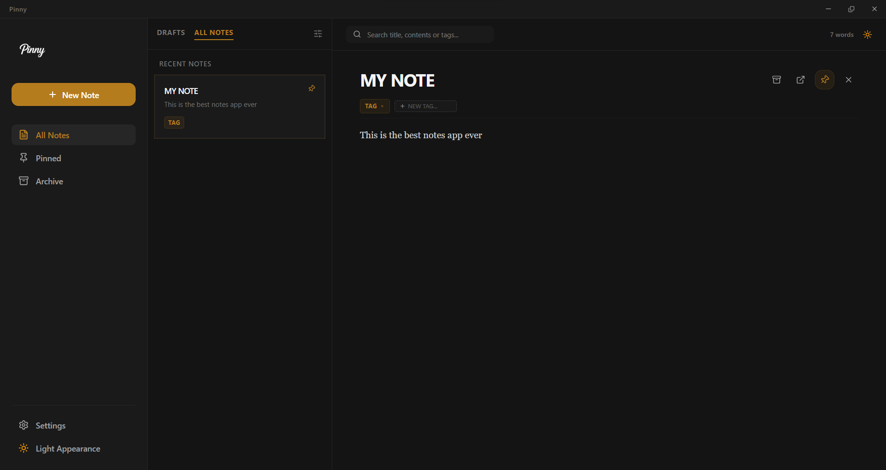

# Pinny

A local-first desktop notes app built with **Electron, React, and Vite** — write in Markdown, pin any note out into a small always-on-top sticky window, and capture a thought from anywhere on your OS with a single global shortcut.

**Demo:** https://niklausjoelbjunior.github.io/Pinny-notes-app
**Preview:**



---

## Overview

Pinny is a notes app built around one idea: capturing and revisiting thoughts should take zero friction. Everything is stored locally on your machine — no account, no sync service, no cloud dependency. Two features carry the concept beyond a standard notes-app clone: notes can be pinned into their own compact always-on-top windows that sit on your desktop like physical sticky notes, and a system-wide keyboard shortcut opens a tiny capture window from any application, so a passing thought never requires switching context to the full app.

## Features

- **Markdown note-taking** — clean writing surface with a live preview toggle
- **Tags + full-text search** — organize and find notes without rigid folder hierarchies
- **Pin-to-desktop sticky notes** — pin any note into its own small, frameless, always-on-top window; pin several at once and arrange them around your desktop
- **Global quick-capture shortcut** — a system-wide hotkey (`Cmd/Ctrl+Shift+N`) opens a minimal capture popup from anywhere on the OS; type, hit enter, it's saved
- **Dark and light mode** — designed as a true pair, not just inverted colors
- **Fully local storage** — notes persist on-disk via `lowdb`; nothing leaves your machine

## Tech Stack

- **Electron** (main process: multi-window management, global shortcuts, local persistence)
- **React 19** + **Vite** (renderer)
- **Tailwind CSS**
- **react-router-dom** (`HashRouter`, since the main window, sticky windows, and the quick-capture popup are all distinct in-app views loaded from the same built bundle)
- **lowdb** (local JSON-based storage)
- **react-markdown** (Markdown preview rendering)
- **lucide-react** (icons)

## Architecture Notes

- **Multiple `BrowserWindow` instances.** Unlike a typical single-window Electron app, Pinny's main process manages a dynamic set of windows: one main window, an on-demand quick-capture popup, and one sticky window per pinned note — each frameless, independently `alwaysOnTop`, and tracked in a `Map` keyed by note ID so re-pinning an already-open note focuses it instead of duplicating it.
- **Global shortcuts.** Registered via Electron's `globalShortcut` API at app startup and explicitly unregistered on quit — the quick-capture window is created lazily on first trigger and hidden (not destroyed) on blur, so subsequent invocations are instant.
- **Hash-based routing.** Because sticky/quick-capture windows load the same built `index.html` with a different in-app route rather than a real server path, the app uses `HashRouter` instead of `BrowserRouter` — this is required for routing to resolve correctly once the app is packaged, not just in dev.
- **Security-conscious IPC.** Every window runs with `contextIsolation: true` and `nodeIntegration: false`; all privileged operations (opening/closing sticky windows, window controls) go through a narrow `preload.cjs` bridge.

## Getting Started

```bash
git clone https://github.com/<your-username>/pinny-notes.git
cd pinny-notes
npm install
npm run electron:dev
```

Boots the Vite dev server and launches Electron pointed at it, with hot reload for the renderer and auto-restart (via `electronmon`) when main-process files change.

### Build

```bash
npm run electron:build
```

## Project Structure

```
pinny-notes/
├── electron/
│   ├── main.js         # window management, global shortcut, IPC handlers
│   └── preload.cjs      # secure bridge between main and renderer
├── src/
│   ├── components/       # Sidebar, NoteEditor, NoteCard, TagChip, PinButton
│   ├── context/           # NotesContext (CRUD + persistence), ThemeContext
│   ├── layouts/            # MainLayout
│   ├── pages/               # Home, QuickCapture, StickyNote
│   ├── routes/                # route definitions
│   └── utils/
└── package.json
```

## What This Project Demonstrates

- Managing multiple independent Electron `BrowserWindow` instances from a single main process
- System-level integration: global keyboard shortcuts, always-on-top frameless windows
- Local-first data persistence with no backend
- Routing across multiple app entry points sharing one build (`HashRouter`)
- Secure IPC design consistent across every window type in the app
- Designing genuinely paired dark/light themes rather than a single inverted palette

## Author

Niklaus Joel B Jr · niklausjoelbjr@gmail.com
